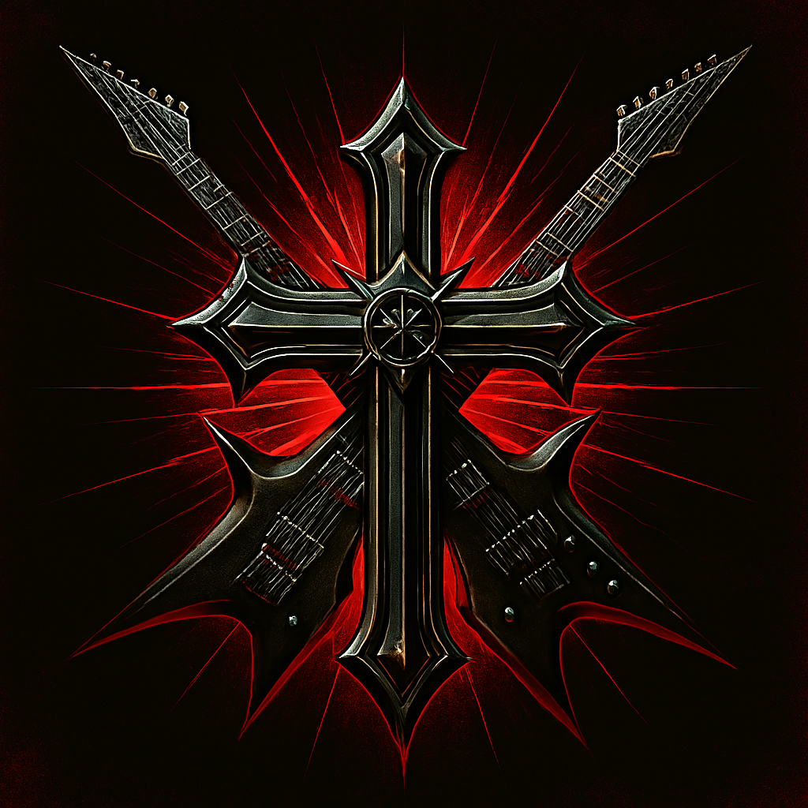

# 👋 Olá! Eu sou Ágatha Gonçalves

<div align="center">
  
</div>

## 🚀 Sobre mim

```python
class AgathaGoncalves:
    def __init__(self):
        self.name = "Agatha Gonçalves"
        self.role = "Desenvolvedora BackEnd"
        self.language_spoken = ["pt_BR", "en_US"]
        self.code = ["Python", "CSS", "JavaScript", "TypeScript", "HTML"]
        self.interests = ["BackEnd Development","Machine Learning", "Data Science"]
        self.currently_learning = ["Deep Learning", "React", "Docker"]
        self.fun_fact = "Amo resolver problemas com código!"
    
    def say_hi(self):
        print("Obrigada por visitar meu perfil! Vamos codar juntos? 🚀")

me = AgathaGoncalves()
me.say_hi()
```


## 🛠️ Tecnologias & Ferramentas

<div align="center">

### Linguagens


### Frameworks & Bibliotecas


### Infraestrutura & DevOps


### Bancos de Dados


### Ferramentas


</div>


## 🎯 Projetos em Destaque

<div align="center">

[](https://github.com/AgathaGoncalves/generator-codebar)
[](https://github.com/AgathaGoncalves/Investfy_PSW)


</div>

## 🏆 Troféus do GitHub

<div align="center">
  
</div>

## 💡 Poema

<div align="center">

<p align="center">
<em>
Pra que serve<br/>
tantos códigos?<br/>
se a vida<br/>
não é programada<br/>
e as melhores coisas<br/>
não tem lógica
</em>
</p>
</div>

## 🎵 Spotify Playing

<div align="center">
  <a href="https://open.spotify.com/playlist/5fjHBpV19r1eBtE2rDDnXd?si=741b9c174f7d4e97" target="_blank">
    
  </a>
  <p> click to heering </p>
  <br><br>
</div>


## 📫 Chama ai!

<div align="center">

[](https://www.linkedin.com/in/agatha-gonc/)
[](mailto:agathag.silva99@gmail.com)
[](https://www.instagram.com/hta_9944/)

</div>

## 📚 Blog & Artigos

- 🔗 [Artigo Ebook com IA?](https://web.dio.me/articles/explorando-utilidades-basicas-em-python-um-ebook-criado-com-a-ajuda-da-ia?back=/articles)
- 🔗 [Python para iniciantes: Dicas essenciais](https://www.linkedin.com/posts/agatha-gonc_nerdoo-com-python-utilidades-essenciais-activity-7226622761203339264-hhHH?utm_source=share&utm_medium=member_desktop&rcm=ACoAAC7ePSQB89ZcqmEVZKmFU315iLV1jYeV8aU)
- 🔗 [AWS Summit 2024](https://www.linkedin.com/posts/britodev_ontem-tive-o-dia-mais-feliz-da-minha-vida-ugcPost-7230157237980196866-nKt1?utm_source=share&utm_medium=member_desktop&rcm=ACoAAC7ePSQB89ZcqmEVZKmFU315iLV1jYeV8aU)

---

<div align="center">
  
</div>

<div align="center">
  <h3>💖 Obrigada pela visita!</h3>
   <em><b>Amo conectar com pessoas diferentes!</b> Se você quer conversar sobre tecnologia, colaborar em projetos ou apenas trocar uma ideia, não hesite em me chamar! 😊</em>
</div>
